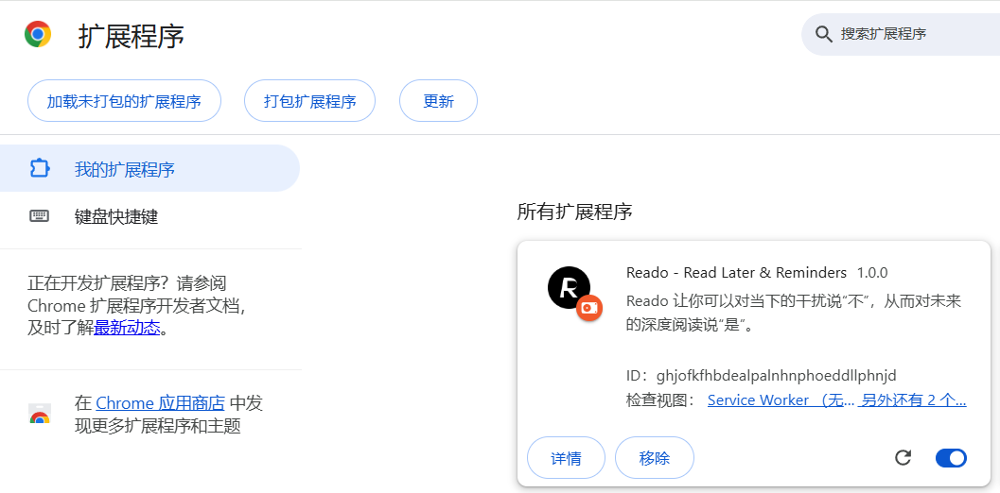
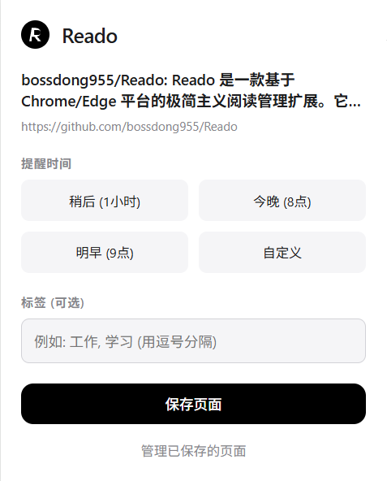
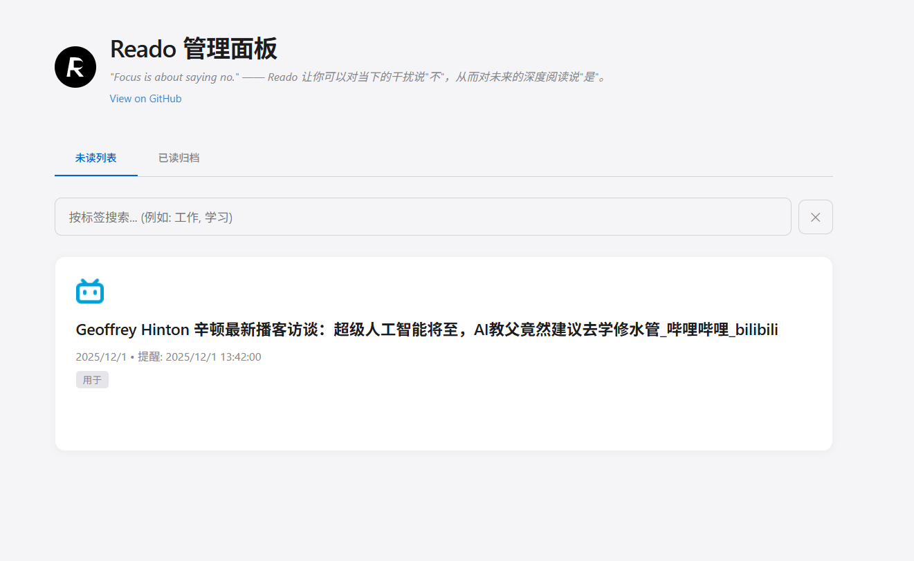

# Reado - 重塑你的数字阅读流

> "Focus is about saying no." ——让 Reado 帮你对干扰说"No"，对深度阅读说"Yes"。

## 1. 产品简介

Reado 是一款基于 Chrome/Edge 的轻量阅读工具，帮助你真正读完那些被加入待读清单却总被遗忘的网页。添加内容后，Reado 会在设定的时间智能提醒，并自动管理阅读状态，让你的阅读从“加入清单”到“真正完成”形成闭环，不再让知识沉没在书签里。








## 2. 核心功能

### ⚡ 一键闪存 (Instant Capture)
- **极速保存**：点击扩展图标或使用右键菜单，毫秒级保存当前网页。
- **标签系统 (Tags)**：支持添加自定义标签（如"工作"、"学习"），让知识井井有条。
- **零摩擦**：无需填写复杂表单，自动抓取标题、URL 和时间戳。

### ⏰ 智能唤醒 (Smart Recall)
- **场景化提醒**：
  - **稍后 (Later)**：1小时后提醒，适合被打断的短文。
  - **今晚 (Tonight)**：每晚 8 点，利用碎片时间。
  - **明早 (Tomorrow)**：早晨 9 点，开启高效一天。
  - **自定义 (Custom)**：精准设定你的阅读时刻。
- **系统级通知**：通过浏览器原生通知直接唤起，支持"打开页面"和"推迟 1小时"操作。
- **智能推迟**：点击"推迟 1小时"后，系统会自动更新提醒时间并同步存储。

### 🔄 自动闭环 (Auto-Completion)
- **自动已读**：当你再次访问已保存的链接时，Reado 会自动将其标记为"已读"，并清除相关提醒。无需手动维护，让列表永远保持清爽。

### 📊 可视化管理 (Visual Gallery)
- **Gallery 视图**：网格布局展示保存的页面，每个卡片显示网站图标（favicon）。
- **未读/已读归档**：清晰的标签页切换。
- **标签搜索**：支持按标签筛选内容，可输入多个标签（逗号分隔），实时过滤。
- **流畅动画**：卡片悬停时有平滑的缩放和阴影效果，操作按钮智能显示。
- **轻量化交互**：删除、标记已读，一切操作都在指尖。

## 3. 设计哲学：Jobs Minimalist

Reado 采用致敬 Apple 的极简主义设计语言（Jobs Minimalist Theme）：
- **黑白灰主色调**：去除一切视觉噪音，让内容成为主角。
- **极致排版**：使用系统级字体栈，提供最舒适的阅读体验。
- **精致图标**：128x128、48x48、16x16 三种尺寸的 PNG 图标，清晰锐利。
- **流畅动画**：精心调校的 CSS 过渡效果，每个交互都如丝般顺滑。

## 4. 安装指南

### 开发者模式安装
1. 下载本项目源码到本地。
2. Chrome 浏览器，访问 `chrome://extensions`，Edge 浏览器访问`edge://extensions/`。
3. 开启 **"开发者模式" (Developer mode)**。
4. 点击 **"加载已解压的扩展程序" (Load unpacked)**。
5. 选择本项目文件夹即可。

### 使用说明
1. **保存页面**：点击工具栏图标，选择提醒时间（可选），添加标签（可选），点击"保存页面"。
2. **查看管理**：点击弹窗中的"管理已保存的页面"链接，打开可视化管理面板。
3. **标签搜索**：在管理面板的搜索框中输入标签名称，实时筛选内容。
4. **接收提醒**：到达设定时间后，会收到系统通知，可选择"打开页面"或"推迟 1小时"。

## 5. 技术架构

- **核心标准**：Manifest V3
- **架构模式**：Event-driven Service Worker
- **数据存储**：`chrome.storage.sync`
- **通知系统**：`chrome.alarms` + `chrome.notifications`
- **状态监听**：`chrome.tabs.onUpdated`（实现自动已读功能）
- **UI 框架**：原生 HTML/CSS/JS，零依赖，追求极致性能与原生体验
- **图标格式**：PNG（128x128、48x48、16x16）

## 6. 文件结构

```
Reado/
├── manifest.json          # 扩展配置（Manifest V3）
├── background.js          # Service Worker（闹钟、通知、自动已读）
├── popup.html            # 弹窗界面
├── popup.js              # 弹窗逻辑（保存、提醒设置）
├── dashboard.html        # 管理面板
├── dashboard.js          # 管理面板逻辑（展示、搜索、操作）
├── style.css             # 全局样式（Jobs Minimalist Theme）
├── assets/
│   ├── icon16.png        # 16x16 图标
│   ├── icon48.png        # 48x48 图标
│   ├── icon128.png       # 128x128 图标
│   ├── icon_jobs.svg     # SVG 图标（仅用于 UI 展示）
│   └── fallback_icon.png # 备用图标
└── README_CN.md          # 项目文档
```

## 7. 调试技巧

### 查看 Service Worker 日志
1. 打开 `chrome://extensions`
2. 找到 Reado 扩展
3. 点击"Service Worker"链接
4. 在控制台中查看详细日志

### 日志说明
- `⏰ Alarm created` - 闹钟创建成功
- `🔔 Alarm triggered` - 闹钟触发
- `📬 Showing notification` - 显示通知
- `😴 Snoozing notification` - 推迟提醒
- `💾 Storage updated` - 存储更新

## 8. Reado 的产品哲学

*(Standing on stage, black turtleneck, pausing for effect)*

"你知道，大多数人认为'稍后阅读'只是一个关于**存储**（Storage）的问题。他们把链接丢进一个无底洞里，然后感觉良好，觉得自己拥有了这些知识。

但他们错了。

**存储是记忆的坟墓。**

当你把一个网页存进书签时，你实际上是在告诉你的大脑：'你可以忘掉它了'。于是，你真的忘掉了。这不仅没有增加你的知识，反而增加了你的**认知负债**（Cognitive Debt）。每一个未读的红点，都是你对自己撒的一个谎。

我们重新思考了这个问题。我们问自己：**我们到底是在管理链接，还是在管理注意力？**

Reado 不是一个书签工具。**Reado 是一个关于'承诺'（Commitment）的协议。**

当你点击那个保存按钮时，你不是在'存储'，你是在与未来的自己签订契约。你设定一个时间，你承诺会回来。而 Reado 的工作，就是确保这个契约被履行。

**真正的极简主义，不是空无一物，而是没有多余的未完成。**

这就是 Reado。它不只是保存网页，它是在**保存你对知识的渴望，直到它被真正消化**。"

---

## 9. 未来规划

- [ ] **阅读模式**：集成类似 Safari 的阅读视图
- [ ] **智能推荐**：基于用户习惯推荐阅读时间
- [ ] **数据导出**：支持导出为 Markdown 或 JSON
- [ ] **快捷键**：添加键盘快捷键支持
- [ ] **统计面板**：显示阅读统计和习惯分析
- [ ] **多端一致**：在所有登录同一 Google 账户的设备上自动同步保存的页面和提醒。

## 10. 开源协议

MIT License

---

**"Focus is about saying no."** —— 让 Reado 帮你对干扰说"不"，对深度阅读说"是"。

